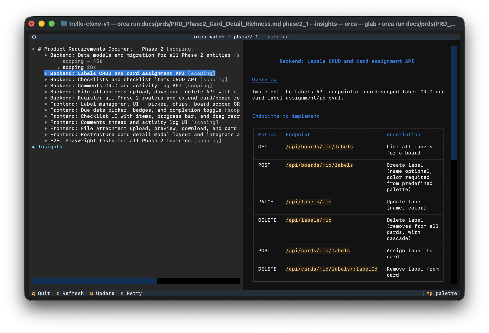

<p align="center">
  
</p>

<h1 align="center">Orca</h1>

Orca orchestrates fleets of AI agents that decompose, plan, build, and merge code — all defined as a YAML state machine with parallel workers and isolated git worktrees. One spec in, working code out.



## Install

```bash
pipx install "git+ssh://git@github.com/gutnikov/orca.git"
```

Update to latest:

```bash
pipx install --force "git+ssh://git@github.com/gutnikov/orca.git"
```

## Example

See [`example/`](example/) for a complete working setup — config, prompts, and a sample task file. Copy it into your repo to get started:

```bash
cp -r example/* your-repo/
```

## Setup

### 1. Create a workflow config

Add `orca.yml` to your repo root:

```yaml
issue:
  fields:
    title:
      type: string
      description: Issue title

initial: todo

states:
  todo:
    worker:
      kind: claude-code
      prompt: prompts/implement.md
      result_format:
        outcome:
          type: enum
          values: [complete, reject]
          description: Implementation result
        reason:
          type: string
          description: Why rejected
          required_when: [reject]
    on:
      complete: done
      reject: todo

  done:
    terminal: true
```

### 2. Write worker prompts

Prompts are Jinja2 templates. Create `prompts/implement.md`:

```markdown
You are working on: {{ issue.title }}

{{ issue.description }}

Implement this feature. When done, respond with your result.
```

### 3. Write a task file

A task file is plain text — first line is the title, rest is the description:

```
Add user authentication
Implement JWT-based auth with login, register, and token refresh endpoints.
```

Save it as `task.md` (or any filename).

### 4. Run it

```bash
orca task.md -b my-feature-branch
```

Orca will:
- Create a git branch `my-feature-branch`
- Spawn a worktree per agent
- Route each issue through the state machine
- Show live progress in the TUI

## Options

```bash
orca task.md -b branch-name              # run with TUI (branch explicit)
orca task.md                             # run with TUI (branch = current)
orca task.md --headless                  # run without TUI
orca task.md -w develop                  # use orca.develop.yml workflow
orca task.md --insights                  # enable progress monitoring agent
```

## Workflow features

**Transitions** — route issues to different states based on worker output:

```yaml
on:
  complete: done
  needs_review: reviewing
  reject: todo            # loops back for retry
```

**Decomposition** — a worker can break an issue into sub-issues:

```yaml
states:
  scoping:
    worker:
      kind: claude-code
      prompt: prompts/scope.md
      result_format:
        outcome:
          type: enum
          values: [decompose, implement]
        sub_issues:
          type: list
          items: "$issue"
          required_when: [decompose]
    on:
      decompose:
        action: decompose
        then: todo
      implement: implementing
```

**Serialized execution** — limit parallel workers per state:

```yaml
states:
  apply:
    max_workers: 1    # one at a time
```

**Timeouts and retries:**

```yaml
max_worker_retries: 3     # global retry limit (default: 5)

states:
  implementing:
    worker:
      timeout: 300        # seconds per worker run
    max_visits: 2         # max times an issue can enter this state
```

## TUI keyboard shortcuts

| Key | Action |
|-----|--------|
| `q` | Quit |
| `r` | Force refresh |
| `u` | Update transcript panel |
| `n` | Retry failed issue |

## Development

```bash
uv sync                        # install dependencies
uv run pytest                  # run tests
uv run ruff check .            # lint
uv run mypy src/               # type-check
```
